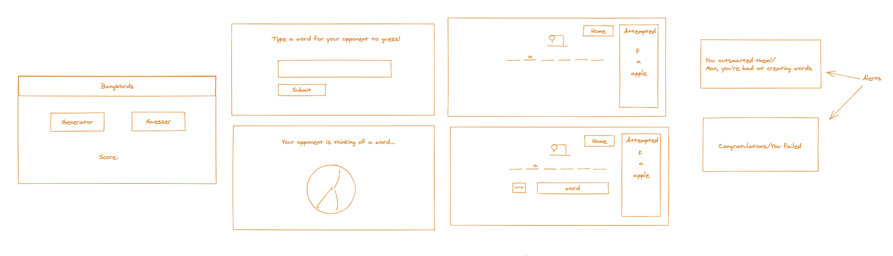
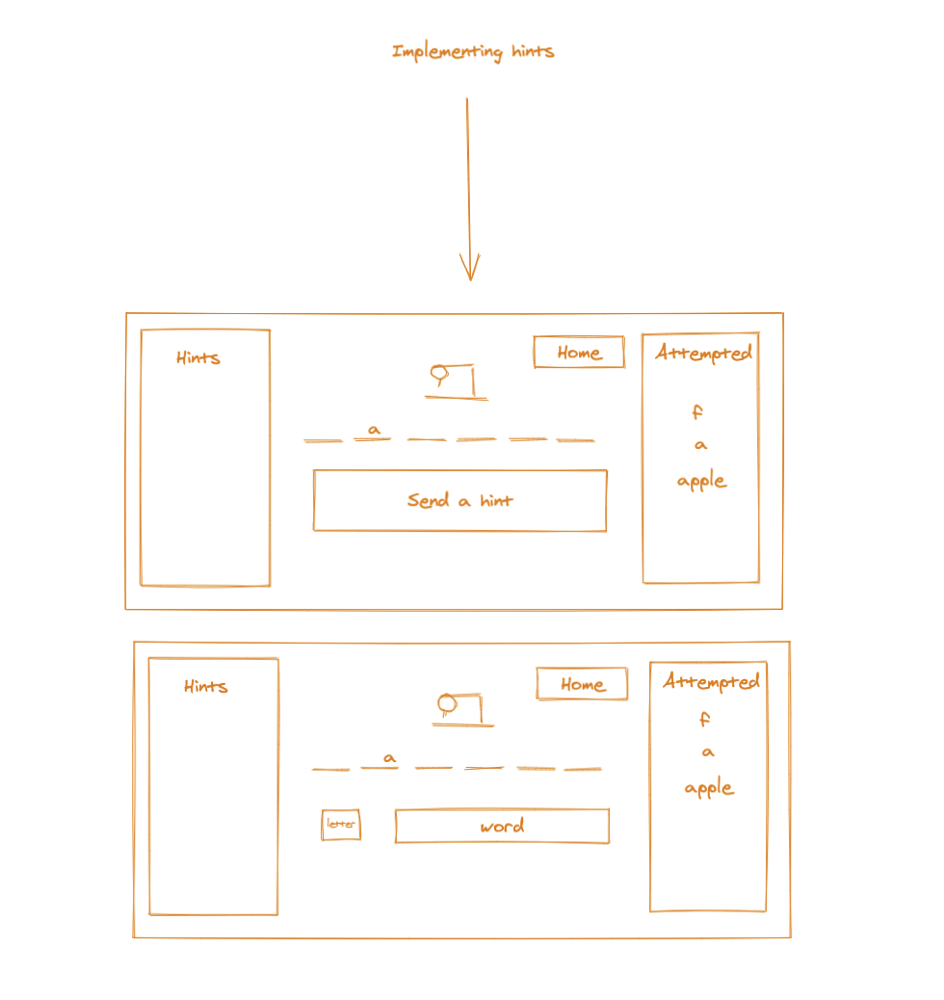
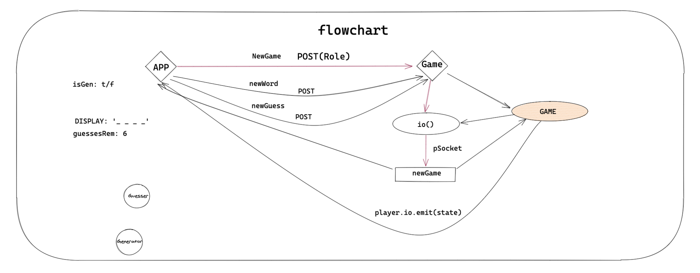
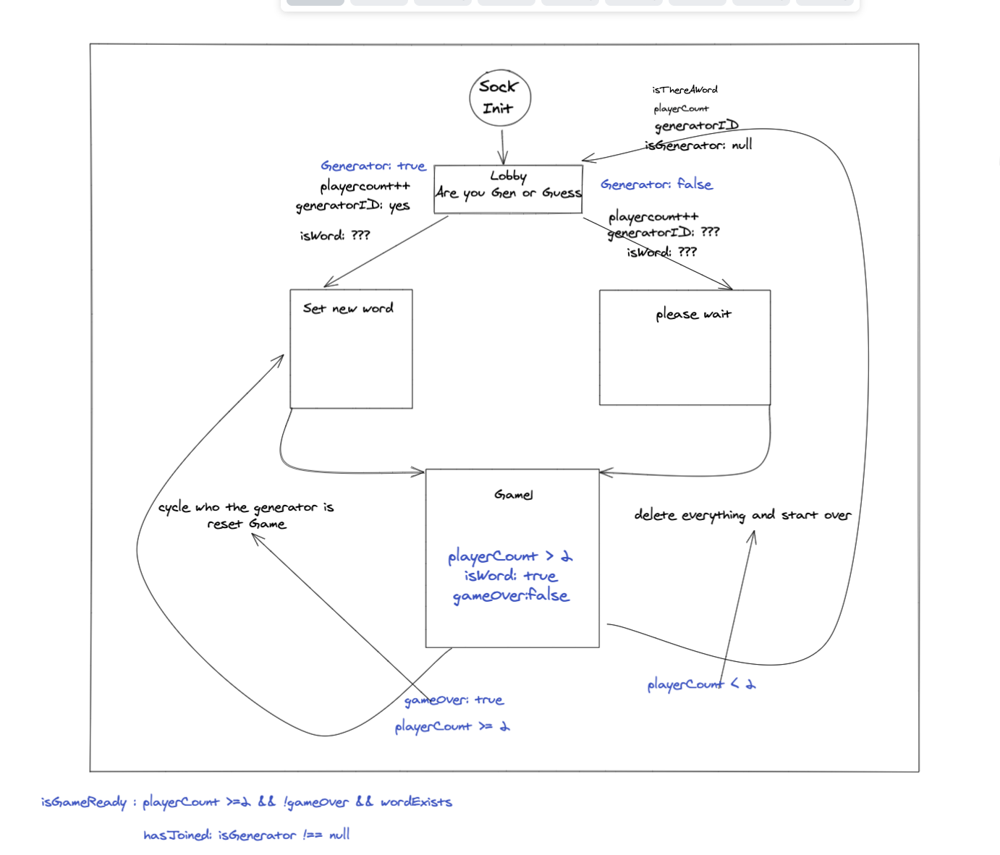

[![Contributors][contributors-shield]](https://github.com/GreyMatteOr/bangwords/graphs/contributors)
[![Forks][forks-shield]](https://github.com/GreyMatteOr/bangwords/network/members)
[![Issues][issues-shield]](https://github.com/GreyMatteOr/bangwords/issues)
[![Stars][stars-shield]](https://github.com/GreyMatteOr/bangwords)

## BangWords


<br><br>

### Contributors

---

Matthew Lane [@GreyMatteOr](https://github.com/GreyMatteOr)

Chris Castanuela [@Chriscastanuela](https://github.com/Chriscastanuela)

Ian Holladay [@holladayian](https://github.com/holladayian)

<br><br>

### The _*sauce*_
---

`<!-- did we launch this already? -->`
[Link to our app](https://bangwords.herokuapp.com/)

[API](https://bangwords-api.herokuapp.com/) 


`<!-- lets put some love into this guy as well -->`
[API Repo Link](https://github.com/GreyMatteOr/bangwords-api) 

<br><br>

### What it is 🤙
---

This app is a knock off of a very popular childrens game. One person chooses to generate a word, while the other one takes turn guessing possible letters it contains. If a guesser guesses all of the possible letters of the generated word OR, the word itself, before they run out of allotted failed attempts, they win the game. 

<br><br>

### What it does
---

The BangWords application connects ^two or more^ players to a server using sockets. Here, a game is run, holding the state of the word, deciding if guesses are correct, and returning verdict back to the clients. The clients then parse this data through React components to display and interact with on the DOM. 

<br><br>

### What we tried to do
---

We were given a project and a list of technologies to research. We chose [Building a Backend](https://frontend.turing.io/projects/module-3/stretch.html#building-a-backend). 
Our goal was simple, create a server with Express, and create an application for users to interact with it. 
`<!-- do we want to link the Project Aim file? Maybe viewer only -->`
We origionally wanted to make an interactive puzzle solving page, but upon review from our project managers we decided to make our application a bit more humble. 

<br><br>

### Our Rough Draft
---






<br><br>

### Our Final Product
---


<br><br>

### How to Work It
---

* Clone down [the BangWords repo](https://github.com/GreyMatteOr/bangwords)
* CD into it.
* `$npm install` the necessary dependencies.
* Take a look.
* Feel free to `$npm test` some things out.

<br><br>

### The Necessary Dependencies
---

`<!-- I'm too lazy to look them up right now -->`

<br><br>

## Technologies
---
```
React
sockets
Express
```
<br><br>

### Special Thanks to our Project Managers
---

[Khalid Williams](Probably should ask first)

[Leta Keane](Maybe link their linkedin too?)


<br><br>
<br><br>
<br><br>
<br><br>
<br><br>


[contributors-shield]: https://img.shields.io/github/contributors/GreyMatteOr/bangwords.svg?style=flat-square
[contributors-url]: https://github.com/GreyMatteOr/bangwords/graphs/contributors
[forks-shield]: https://img.shields.io/github/forks/GreyMatteOr/bangwords.svg?style=flat-square
[forks-url]: https://github.com/GreyMatteOr/bangwords/network/members
[stars-shield]: https://img.shields.io/github/stars/GreyMatteOr/bangwords.svg?style=flat-square 
[stars-url]: https://github.com/GreyMatteOr/bangwords/stargazers
[issues-shield]: https://img.shields.io/github/issues/GreyMatteOr/bangwords.svg?style=flat-square
[issues-url]: https://github.com/GreyMatteOr/bangwords/issues
[product-screenshot]: images/screenshot.png
